# 因子檢測

多因子檢測管理區，展示使用者所建構之多因子檢測，表格中對每一個檢測均展示因子資訊、股票池資訊、回測期間資訊和交易成本與限制等參數，方便使用者查看當初建立的檢測條件。

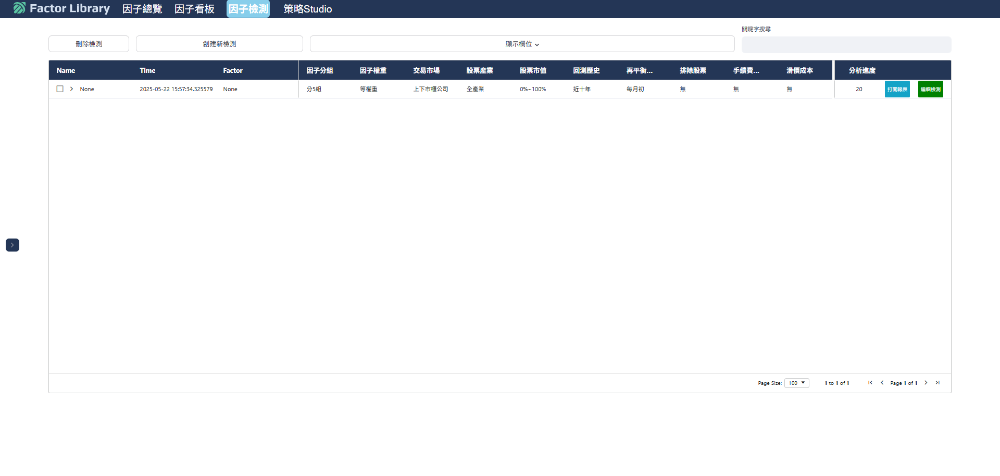

## 檢測列表

點擊檢測名稱旁按鍵會展示該投組所使用之因子資訊，包含名稱、權重、方向和前處理方式。

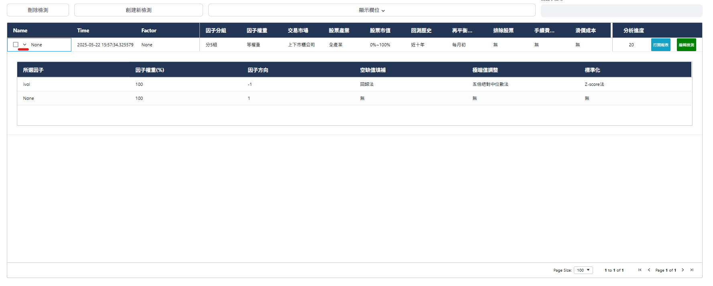

若使用者想減少列表顯示之欄位數，可點擊中間上方之「顯示欄位」按鍵，會出現可供篩選下方列表欄位的控制面板，點選後再按下「確認」即可。

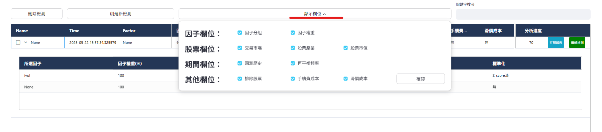

註：初次設定可能會出現loading狀態，請稍等後再重新嘗試。

## 打開報表

當每個檢測最右邊的分析進度欄位達到100後，表示此分析資訊與圖表均產生完畢，使用者可點擊左側之「打開報表」按鍵，頁面將跳轉並載入相關畫面。

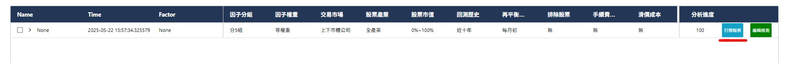

首次載入畫面應顯示為因子值分布圖表(如下圖)，同時左側為可供查看之因子檢測分析資訊，共有敘述統計、因子分析、投組分析、風險分析、泛用性分析與學術檢定等六大類別，更詳細說明請參考後續頁面。

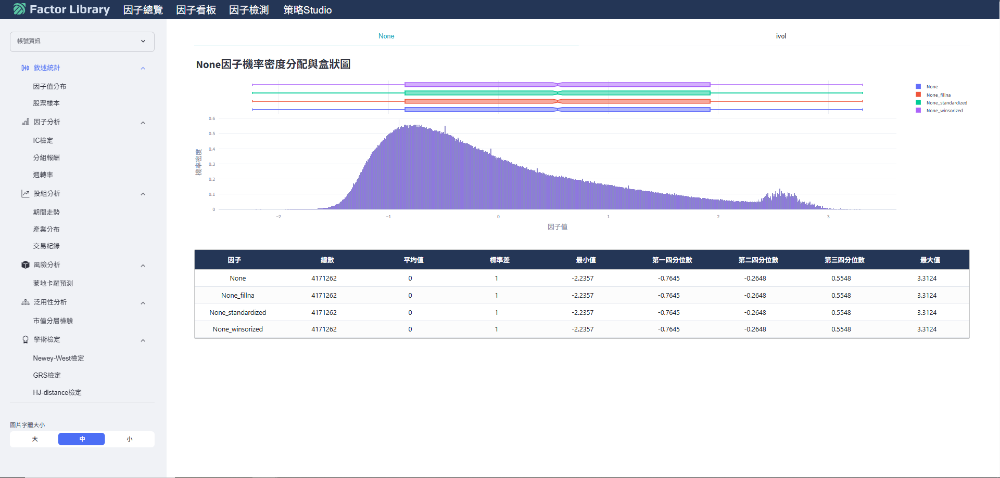

## 建立新檢測

點擊下圖「創建新檢測」按鍵後將跳轉至因子檢測器面板。

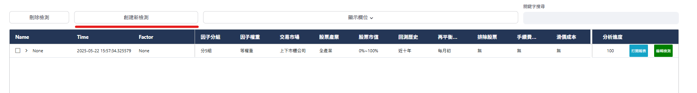

該面板提供完整的因子前處理方式與投組股票池設定參數，讓使用者可針對特定單因子或組出複合因子進行檢驗。

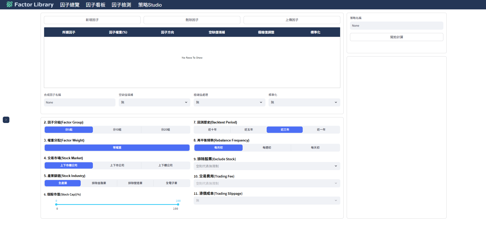

檢驗流程如下：
1. 點擊「新增因子」選擇欲研究之單因子或多因子，如下圖點選會跳出因子資料庫的表格，所有因子均支援查看更多因子說明與公式的功能。

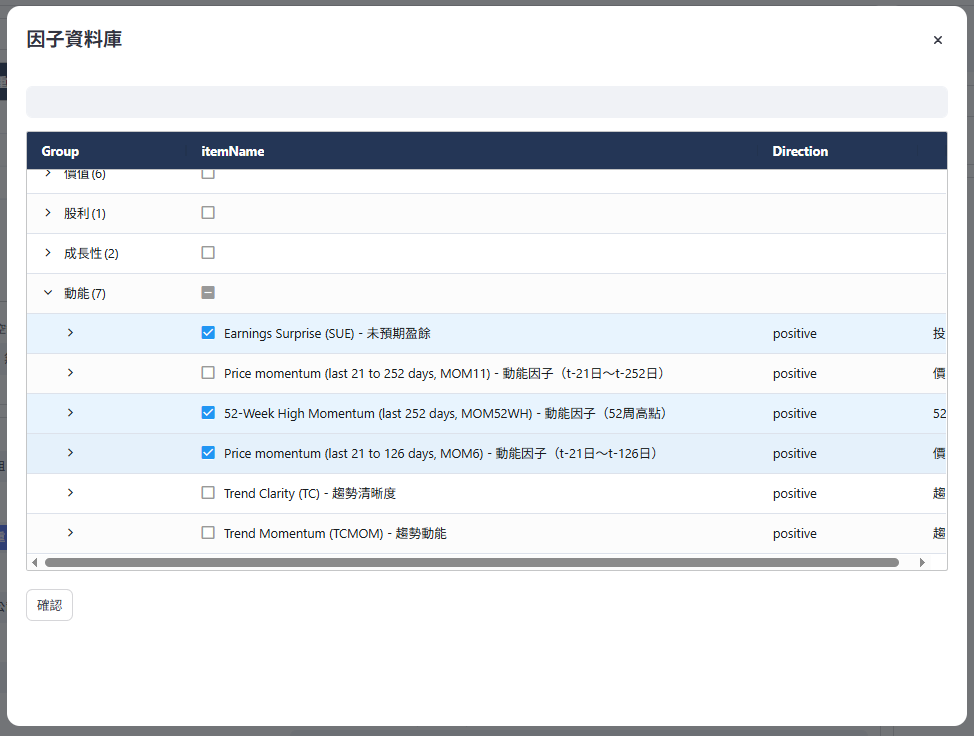

2. 選擇完有興趣的因子後須點擊「確認」，即可看到當初選的SUE、MOM52WH和MOM6等三個因子已顯示出來。後續可再針對每一個因子進行空缺值填補、極端值調整與標準化等三項前處理工程，詳細說明見後續頁面。使用者亦可上傳自製因子進行分析。此外，使用者亦可對新合成之因子進行再次前處理。紅色框格為刪除因子前須先點選欲刪除的因子，再按下刪除因子始可刪除。

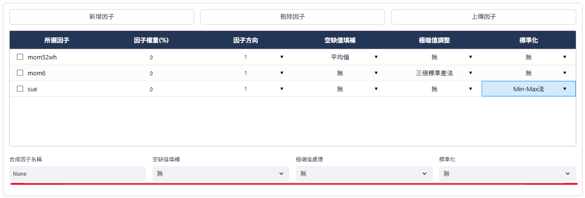

註：每項因子都選擇完前處理方法後，也可針對合成完後的因子再選擇一輪空缺值填補、極端值調整與標準化。

3. 選擇完上面的因子後，下一步可針對因子分組的組數、股票池市場、產業與回測期間進行篩選。

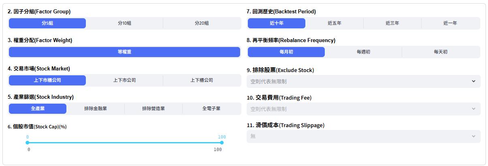

- 1.	因子分組&權重分配：選擇欲切割的因子分組數，以及各組內成分股權重分配方式（目前預設為等權重）。
- 2.    股票條件：選擇欲使用之股票池市場、產業、市值區間等條件。
- 3.    回測期間：選擇欲分析的歷史長度和投組再平衡頻率。
- 4.	交易限制：進一步排除全額交割、警示股等樣本，或增設交易費用和滑價成本。

4. 確認完所有的因子與股票池條件等參數後，可為該次檢測命名後點擊「開始計算」，系統即開始進行分析，並且將進度即時更新至檢測列表與下方的計算進度中。

註：於計算期間更改檢測器參數將不會影響本次計算，若要更新參數值須先按下「停止計算」，檢測器才會根據最新一次參數進行計算。此外，使用者不必於本頁等候分析完成，可於其他頁面等待分析進度至100後再去點擊「打開報表」查看資訊。

## 編輯檢測

若使用者欲根據過往的檢測紀錄進行微調，可點擊右側中的「編輯檢測」按鍵，頁面同樣會跳轉至因子檢測器，同時也會載入上次檢測完的參數。

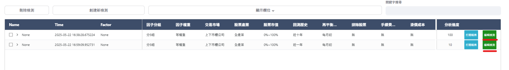

如下圖點選先前的三個動能因子SUE、MOM52WH和MOM6檢測紀錄，並載入此前相關參數供使用者微調，而不必手動再去重新點選。

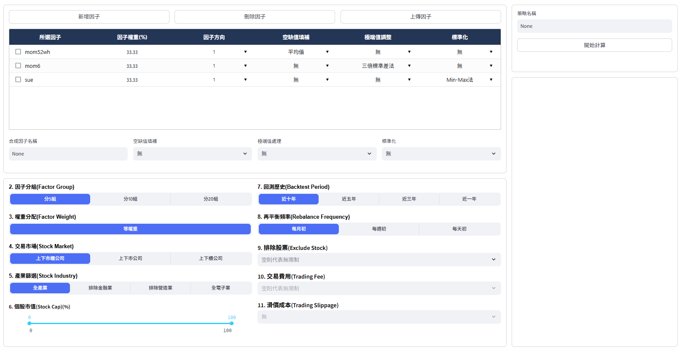

註：經由編輯檢測微調參數並開始計算後，原本之因子檢測紀錄也將被覆蓋過去，並不會創造出另外獨立的檢測紀錄。