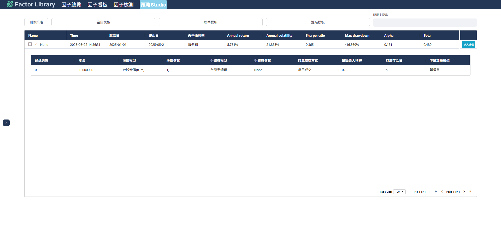
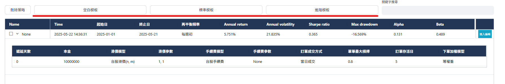
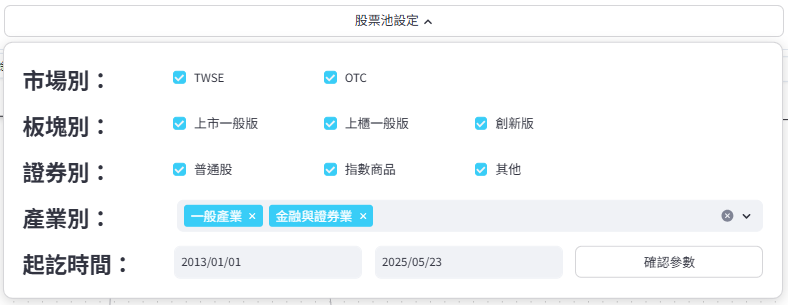
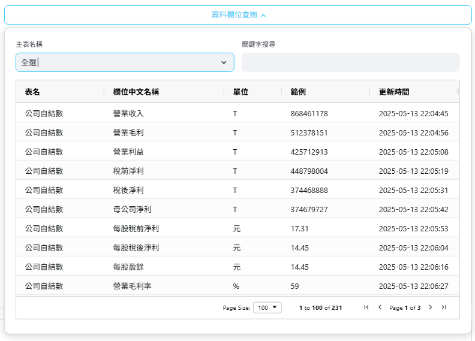
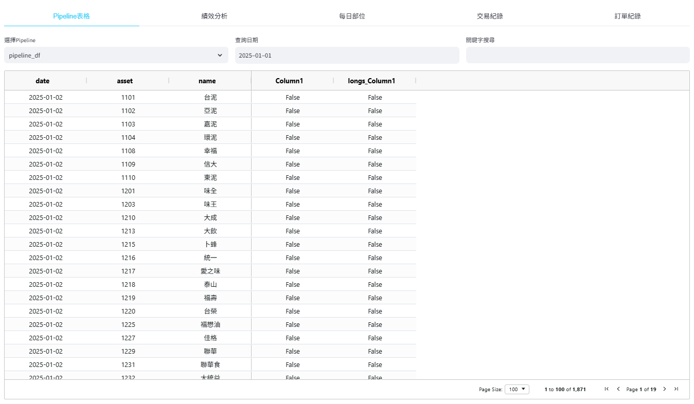
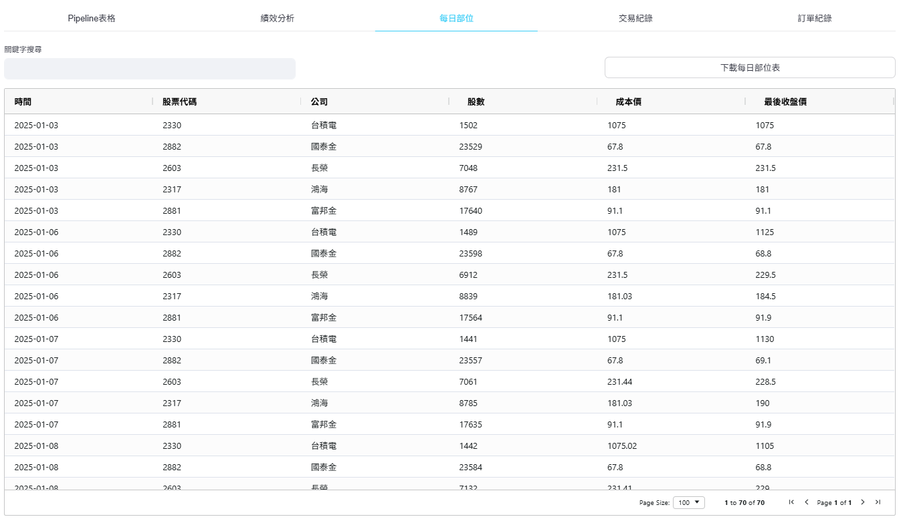

# 策略Studio

基於節點流程圖來實現策略回測，使用者僅需滑鼠即可完成從資料載入、條件篩選計算、投組建構與策略回測等功能。

## 策略列表

流程圖策略管理區，展示使用者所建構之所有流程圖策略紀錄，主要顯示回測起迄日、再平衡頻率以及最近一次回測出的策略績效指標。

列表上方提供三種流程圖模板：空白模板、標準模板與進階模板，均會跳轉至流程圖建構區，並且新增一筆流程圖策略的建構紀錄。此三者區別僅在於流程圖中使用的節點數量與複雜度不同，供使用者進行參考與修改。

-------------

- 標準模板：全上下市櫃的股票池中，每週初挑選公司營業利益成長率相較於四季前有所成長，從中篩選市值最小的20間公司，最終篩選出保留盈餘最大的10間公司，採等權重買入，每支最大槓桿80%。

-------------

- 進階模板：全上下市櫃的股票池中，每週初挑選股價淨值比最小的500間公司，且公司常續ROE相較於四季前有所成長，最後從中篩選初單月營收成長率％最高的20間公司，採等權重買入，每支最大槓桿90%。

-------------

## 編輯流程圖

流程圖中央之畫布主要以滑鼠作為控制器，僅需向畫布中點擊滑鼠右鍵即可召喚出選單去挑選所需之節點(node)，再將各節點對應的輸出與輸入用滑鼠左鍵進行相連，最後按下右下角之「Execute」按鍵，系統就將執行畫布中所形成之節點。

如上述之操作則是從畫布中挑選「資料載入－最新資料」節點，並與「回測產出－Pipeline產出」節點進行相連，最後按下「Execute」按鍵的範例。該操作等同於載入股票池中每家公司最新一日的母公司淨利，並且產出一可供查看之表格。

詳細的流程圖畫布操作說明如下：

- 召喚節點：畫布中點擊滑鼠右鍵。

- 拖移節點：滑鼠左鍵長按欲拖移之節點。

- 連線節點：滑鼠左鍵點擊並長按節點中的紅點(輸出項)，拖移至另一節點的綠點(輸入項)。

- 刪除節點/連線：滑鼠左鍵點擊節點或連線後，按下鍵盤之倒退鍵(Backspace)。

- 執行流程圖：點擊畫布右下角之「Execute」按鍵，右側小面板出現「流程圖計算中．．．」即表示系統運作中。

## 股票池設定

流程圖策略中的股票池預設均為2013/01/01~至今所有曾上下市櫃之公司，若使用者想針對特定股票池進行設定可於此面板選擇條件後按下「確認參數」即會生效。

## 資料欄位查詢

查詢最新資料與歷史資料節點所能載入之資料表與欄位名稱，也提供資料之單位與範例，方便使用者查找與使用。

## 執行回測

1. 使用至少一資料載入節點搭配一條件計算節點進行搭配，篩選出每次在平衡時要買入之股票。將該篩選股票的條件式接入回測產出節點後點擊「Execute」按鍵，就能產出一個準備回測的策略供選擇。
2. 使用者從右邊小面板中的下拉選單選擇欲回測之策略名，再點擊小面板最下方之「開始計算」後，Studio最左下角就會出現「系統初始化中．．．」，代表系統已經在執行本次回測。

<video width="792" height="360" controls>
  <source src="../../_static/studio_demo1_speedup.mp4" type="video/mp4">
  您的瀏覽器不支援影片播放。
</video>

上面影片為挑選公司自結數－母公司淨利最大的5檔股票，並於每天進行換股的策略流程圖。

## 查看報表

查看報表為策略Studio下方結果產出區塊，提供Pipeline表格、績效分析、每日部位、交易紀錄與訂單紀錄等，展示詳細的回測報表、策略績效和對應的績效圖表。

- Pipeline表格：若使用者於流程圖面板處有使用任一資料載入節點＋Pipeline產出節點，下方即可產出表格供查看，並且可選擇任一日期中所有位於股票池之資料。下圖為每一天母公司淨利最大5檔並標記為True/False的欄位。

- 績效分析：回測結束後點選績效分析區塊，會顯示本次策略之績效指標與各類圖表，目前支援圖表有「累計報酬、年度報酬、月報酬熱力圖、月報酬分布、滾動夏普、滾動Beta、回撤期間走勢、淨值回撤幅度、每日持股狀態、每日換手率、總槓桿倍數、每日曝險程度、多空持倉比例、最大與中位數持倉集中度」，使用者可從右側下拉選單中擇一進行查看。下圖為每天換股購買最大5檔母公司淨利公司的累積報酬率圖。

- 每日部位、交易紀錄與訂單紀錄：此三區塊為每次策略固定會產出之報表，依序為投組每天持有之股票部位、每次換股時的交易價格與股數、換股時所送出之訂單與執行結果。此外，三表均提供下載按鈕，使用者點擊後可將其用csv的檔案格式進行保存。

