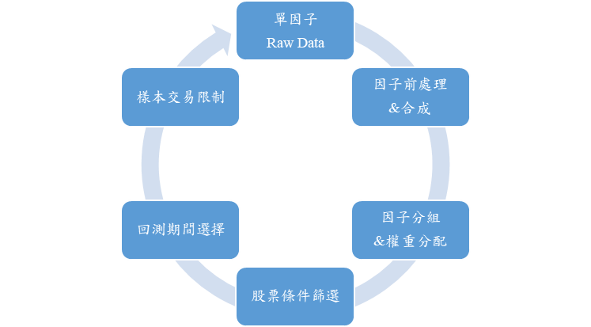
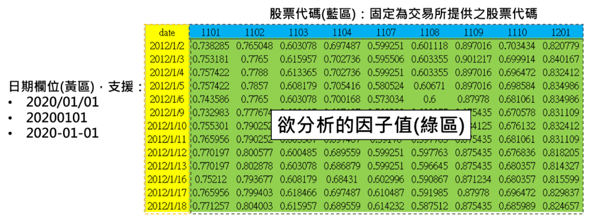
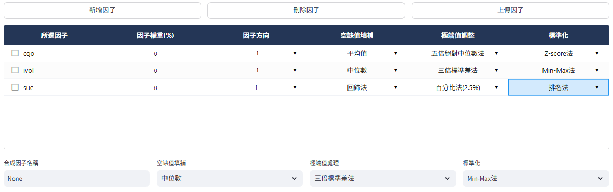

# 多因子合成方法
因子檢測由單因子或多因子經前處理後進行選股，並選擇特定市場、期間與股票條件等參數後完成建構。

<!-- :::{contents}
:local:
:depth: 2
::: -->

## 載入單因子Raw Data

第一階段載入單因子資料主要有兩種方法，一為TEJ的因子資料庫，二為使用者自行上傳之因子資料：
1.	新增因子：使用TEJ整理自學術論文、金融機構研究報告之因子，分為九大類（動能、價值、股息率、成長、品質、波動性、流動性、規模、情緒），初步引入均為原始無調整值。
2.	上傳因子：使用者自行上傳因子原始值資料，須確保首欄為「date」日期，其餘欄位為股票代碼和股票在該日之原始值。如下圖所示：

該範例為mom52wh（創一年新高動能）因子，黃色區塊須為符合的日期格式，藍色區塊須為台股交易市場之股票代碼，綠色區塊為使用者欲分析之因子值。

## 因子前處理＆合成

1. 因子權重：預設均為0，可輸入0~100數字，但並不強制要求總和為100，方便使用者對個別因子做超額加權，若均沒設置數值則系統將自動採等權重配置。
 

2. 因子方向：預設值出自原始論文之研究結果，可輸入1和-1，1代表因子值越大股票報酬也越大，-1則反之，因子值越小股票報酬越大。
 

3. 空缺值填補：
    - 平均值：t日因子值缺失之股票填入t日所有股票因子值之平均值。
    - 中位數：t日因子值缺失之股票填入t日所有股票因子值之中位數。
    - 回歸法：依照產業分配與對數市值對個股因子值進行 OLS 回歸，即：

    $$
    \text{factor}_{i,t} = \alpha_{i,t} + \sum_{j=1}^{N} \beta_j \cdot industry_j + \beta_{N+1} \cdot \log(\text{mktcap}_{i,t}) + \epsilon_{i,t}
    $$

    其中：

    - $factor_{i,t}$ 為 $t$ 日有因子值的第 $i$ 公司；
    - $industry_j$ 為第 $i$ 公司所任產業之虛擬變數，每家公司共有 $N-1$ 個產業虛擬變數；$N$ 為上市櫃產業分類共 35 類
    - $\log(\text{mktcap})$ 為第 $i$ 公司於第 $t$ 日之對數股票市值；
    - $\epsilon_{i,t}$ 為回歸殘差值。

    缺失因子值個股使用所屬產業乘上回歸得出之產業係數，與該日對數市值乘上回歸得出之對數市值係數，再加上常數項後填補空缺值。
 

4. 極端值調整：
    - 五倍絕對中位數法：

        I.   找出所有公司於t日的因子中位數$X_{median,t}$

        II.  得到每家公司於t日的因子值與因子中位數的絕對偏差值$X_{i}−X_{median}$

        III. 得到絕對偏差值的中差MAD

        IV.  對超出正負五倍之MAD因子值調整為正負五倍MAD值
         
    - 三倍標準差法：

        I.   計算出t日所有公司因子的平均值與標準差

        II.  選擇n倍極端值調整

        III. 確認因子值的合理範圍為$[X_{mean}-n*σ, X_{mean}+n*σ]$

        IV.  對超出正負三倍標準差因子值調整為因子值平均加減正負三倍標準差值
         
    - 百分比法（2.5%）：

        I.   計算t日所有公司因子值的第2.5%和第97.5%百分位數值

        II.  對超出第2.5%和第97.5%百分位數之因子值調整為第2.5%和第97.5%百分位數因子值
         
5. 標準化：
    - Z-score法：
        $Z_i = \frac{X_i - X_{\text{mean}}}{\sigma}$，對公司於t日之因子值（$X_i$）減去 t 日所有公司因子平均值（$X_{\text{mean}}$），再除以 t 日所有公司因子標準差（$\sigma$），最終轉換為平均值為 0、標準差為 1 的因子值。
    - Min-Max 法：

        $Z_i = \frac{X_i - \text{Min}}{\text{Max} - \text{Min}}$，將 t 日公司因子值（$X_i$）減去 t 日所有公司最小因子值（Min），除以t日所有公司最大因子值（Max）減去最小因子值（Min），最終轉換為 0～1 之間的因子值。

    - 排名法：

        $Z_i = \text{Rank}(X_i)$，將 t 日公司因子值（$X_i$）調整為 0～1 之間的百分比排名值。

<ol start="6">
  <li> 因子合成：
將前述經過空缺值填補、極端值調整和標準化處理過的因子值，依照使用者設定之因子方向和因子權重進行合成，即：

$$
\text{CombinedFactor}_{i,t} = \sum_{j=1}^n w_{i,j} \cdot \text{FactorDirection}_j \cdot factor_{i,j}
$$

其中：

- $\text{CombinedFactor}_{i,t}$ 為複數個單因子加權而成之複合因子；
- $w_{i,j}$ 為第 $i$ 公司對第 $j$ 因子的權重值；
- $\text{FactorDirection}_j$ 為第 $j$ 因子的因子方向；
- $factor_{i,j}$ 為第 $i$ 公司第 $j$ 因子的值（經前處理調整，若未設定調整選項，則以原始值進行合成）。

 </li>
</ol>

## 因子分組
依據t日所有公司排序後的因子值區分為同等數量的組別，可選擇5、10、20組。

## 權重分配
等權重：在每個再平衡日對各個因子分組內的公司給予一致的權重值。
