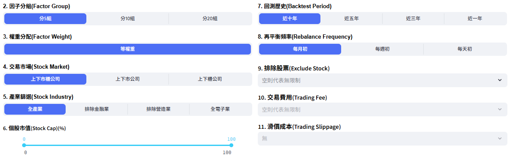

# 股票池與回測期間參數
前面步驟選擇完因子後，將針對股票池與回測期間進行調整，主要根據股票於再平衡t日時所屬的交易市場、產業別、市值大小和交易限制（警示股、全額交割股）等狀況進行排除。

註：因子檢測股票池篩選順序為交易市場 &rarr; 產業別 &rarr; 交易限制 &rarr; 市值大小 &rarr; 因子分組。

<!-- :::{contents}
:local:
:depth: 2
::: -->

## 交易市場

選擇股票於t日所屬之交易市場，提供上下市櫃、上下市與上下櫃。

## 產業篩選

選擇股票於t日所屬之產業，提供全產業、排除營造、排除金融與全電子業。

## 個股市值

篩選股票於t日是否位於指定的區間內，可選擇0 ~ 100%區間。如調整為10 ~100%代表選擇t日時股票市值大於等於10%且小於等於100%之股票。

註：若將區間調整過小（e.g. 99 ~ 100%），恐導致股票數過少而讓因子分組失敗。

## 回測歷史

回測歷史為因子值最新一日時間點，減去一年、三年、五年與十年做為因子檢測的起始時間。

## 再平衡頻率
提供投組於每月初（每月首個交易日）、每週初（每週首個交易日）或每日初，根據公司最新的因子值更換其因子分組與組內的權重值。

## 排除股票

排除股票於t日被列為全額交割、警示或處置的股票。
