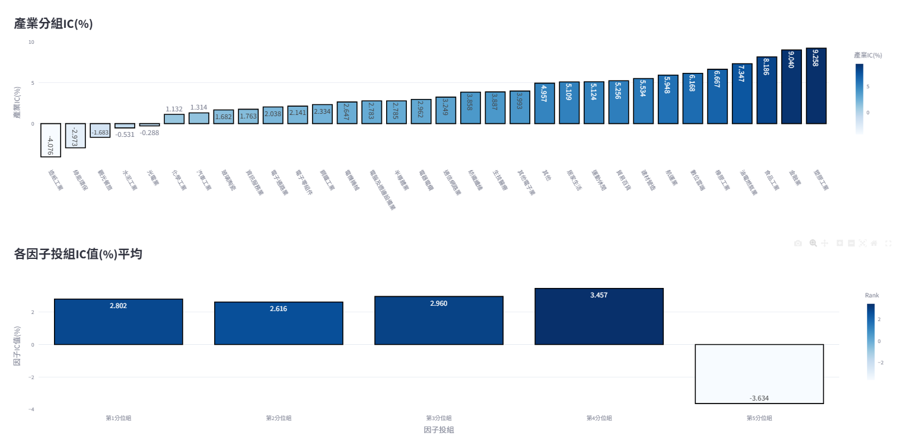
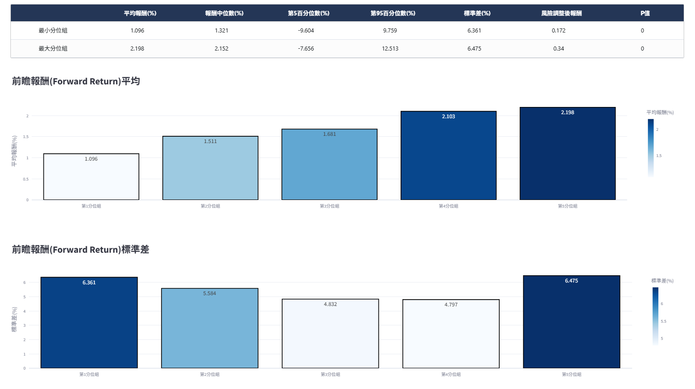
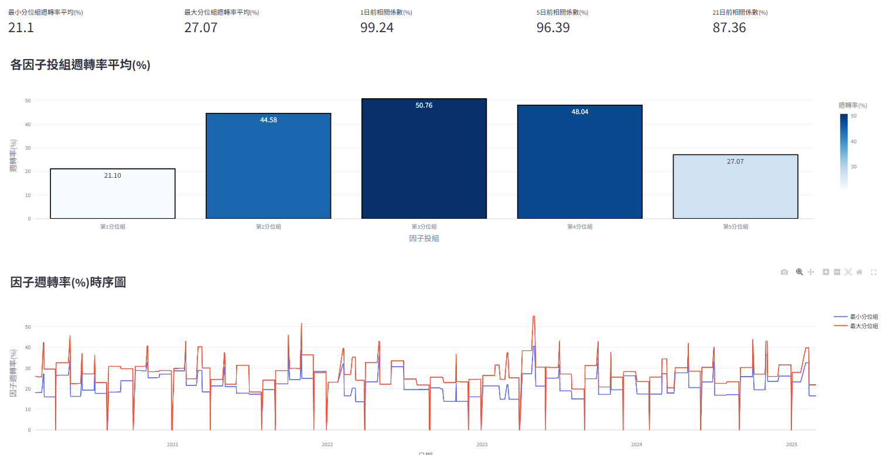
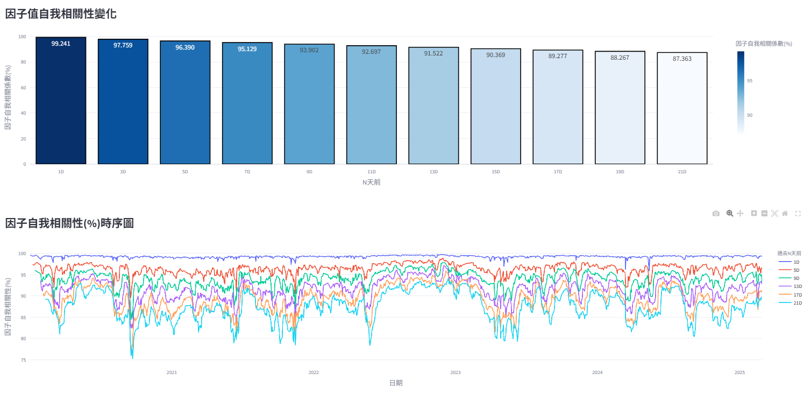

# 因子分析
分析因子對未來報酬之預測能力（IC）、區分未來股票高低報酬區間的能力（分組單調性）與因子值變動的頻率與持續性（分組週轉率）。

<!-- :::{contents}
:local:
:depth: 2
::: -->

## IC資訊係數檢定

檢驗t日因子值與t+N日期間報酬的相關性，相關性絕對值越高代表因子預測個股未來報酬能力越好。由於Pearson要求資料為常態分布，若非常態分布容易失準，因此均使用Spearman相關係數進行計算，公式如下：

$$
\text{Rank IC}_t = \text{Corr}\left(x_{\text{rank}}^t,\ \text{ret}_{\text{rank}}^{t+N} \right)
$$

其中因子在t日的IC值，使用t日排序後因子值與t日至t+N日的排序後個股報酬連乘的共變異數，除以t日排序後因子值標準差和t+N日的排序後個股報酬標準差。
N日依照使用者前面選擇的投組再平衡頻率各有不同，若選擇每月初再平衡則N為21日；每週初再平衡為5日；每日初再平衡為1日。

上圖各數值公式整理如下：
- IC平均值：回測期間所有t日的RankIC總和取平均，判斷因子預測能力顯著與否，公式如下：

    $$
    \text{RankIC} = \frac{1}{N} \sum_{t=1}^{N} \text{RankIC}_t
    $$

    其中N為總樣本期間。
     

- IC標準差：回測期間所有t日的RankIC值取標準差，判斷因子預測能力穩定與否，公式如下：

    $$
    \sigma(\text{RankIC}) = \text{Std}(\text{RankIC}_t), \quad t \in [0, N]
    $$

    其中N為總樣本期間。
     

- 風險調整後IC（IR）：將IC平均值除以同期間IC標準差，判斷因子預測能力有效性，公式如下：

    $$
    \text{IR} = \frac{\text{RankIC}}{\sigma(\text{RankIC})}
    $$

     

- IC統計T、P值：計算IC平均值是否顯著異於0，判斷因子預測能力是否統計上顯著，公式如下：

    $$
    t = \frac{\text{RankIC} - \mu_0}{s / \sqrt{n}}
    $$

    $$
    p = P(T \geq |t| \mid H_0^a)
    $$

    其中$μ_0$為虛無假設下之檢定值，此處為0；s為樣本標準差；n為樣本大小。$P(T \geq |t| \mid H_0^a)$則為t統計量的累積機率。

     

- IC偏度、峰度：計算IC值分布的對稱性與集中程度，公式如下：

    $$
    IC_{\text{skew}} = \frac{1}{n} \sum_{i=1}^{n} \frac{(x_i - \bar{x})^3}{s^3}
    $$

    $$
    IC_{\text{kurt}} = \frac{1}{n} \sum_{i=1}^{n} \frac{(x_i - \bar{x})^4}{s^4}
    $$

    其中$x_i$為第i日的RankIC值；x為整個樣本期間的RankIC平均值；n為總樣本期間。
     

- IC大於0%比例：統計每一個t日IC值高於0%占整個樣本期間比例，判斷因子預測能力方向穩定性。
 

- 每月IC值：為該月份每一個t日IC值總和取平均。
 

- 累加IC值：回測期間每一個t日IC值累加，判斷因子預測能力在時序列上是否具有單調性。

- 產業分組IC：依照證交所與櫃買中心產業分類計算各產業IC平均值，此處不特別區分交易市場，只依據所屬產業進行計算，公式如下：

    $$
    \text{IndustryIC} = \frac{1}{N} \sum_{t=1}^{N} \text{RankIC}_{c,t}
    $$

    $$
    \text{RankIC}_{c,t} = \text{Corr}(x_{\text{rank}}^t,\ \text{ret}_{\text{rank}}^{t+N})
    $$

    其中
    $IndustryIC_{j}$為j產業在樣本期間的IC平均值；
    N為總樣本期間；$RankIC_{t,j}$為j產業下每一個t日中，屬於j產業的個股t日因子值和t+N日報酬之Spearman相關係數。

 

- 各因子投組IC值平均：依照每個再平衡日每檔個股的因子分組計算不同組別的IC平均值，公式如下：

    $$
    \text{GroupIC}_g = \frac{1}{N} \sum_{t=1}^{N} \text{RankIC}_{g,t}
    $$

    $$
    \text{RankIC}_{g,t} = \text{Corr}(x_{\text{rank}}^t,\ \text{ret}_{\text{rank}}^{t+N})
    $$

    其中
    $GroupIC_{g}$為第g因子分組在樣本期間的IC平均值；
    N為總樣本期間；$GroupIC_{t,g}$為第g因子分組下每一個t日中，屬於第g因子分組的個股t日因子值和t+N日報酬之Spearman相關係數。

 

- 因子 IC 積延長變數化（Lag IC）：

    計算每一個t日因子值與未來t+N+lag日個股報酬率的Spearman相關係數，判斷因子的預測能力會在lag幾日後有較明顯的衰退，公式如下：

    $$
    \text{LagIC}_{\text{lag}} = \text{Corr}(x_{\text{rank}}^{t - \text{lag}},\ \text{ret}_{\text{rank}}^{t+N}), \quad \text{lag} \in [1, 21]
    $$

    其中
    $\text{LagIC}_{\text{lag}}$為因子經過lag日後的RankIC值，使用第t-lag日的排序後因子值$x_{\text{rank}}^{t - \text{lag}}$與t日至t+N日的排序後個股報酬連乘計算Spearman相關係數；
    若投組為每月初再平衡則N為21，每週初則N為5，每日初則N為1。

 

- 因子 IC 穩定性變數化（Holding IC）：

    計算每一個t日因子值與未來t+n日個股報酬率的Spearman相關係數，判斷使用該因子較適合預測未來幾日後的個股報酬，公式如下：

    $$
    \text{HoldingIC}_n = \text{Corr}(x_{\text{rank}}^{t},\ \text{ret}_{\text{rank}}^{t+n}), \quad n \in [1, 21]
    $$

    其中
    $\text{HoldingIC}_n$為因子持有n日後的RankIC值，使用第t日的排序後因子值$x_{\text{rank}}^{t}$與t日至t+n日的排序後個股報酬連乘計算Spearman相關係數。

## 分組報酬單調性

使用前瞻報酬（Forward Return）分析因子是否具有單調遞增或遞減特性，也就是使用該因子去選股時，當選擇因子值越大之個股，該個股未來的報酬率越高或報酬率越低，公式如下：

$$
\text{forward return}_{i,t} = \prod_{t=1}^{n} \left(1 + \text{return}_{i,t}\right)
$$

其中$\text{forward return}_{i,t}$為i個股於t日之前瞻報酬，使用t日至t+n日報酬率連乘而來，當投組為每月初再平衡時n為21；每週初再平衡時n為5；每日初再平衡時n為1。

- 前瞻報酬平均：計算各個因子投組下前瞻報酬於樣本期間的平均值，分析該因子是否具有單調遞增或遞減特性，也就是使用該因子去選股時，當選擇因子值越大之個股，該個股未來的報酬率越高或報酬率越低，公式如下：

    $$
    \text{Forward Return}_g = \text{Mean}(\text{Forward Return}_{g,t}),\quad t \in [0, N]
    $$

    $$
    \text{Forward Return}_{g,t} = \sum_{i=1}^{k} w_{i,g,t} \cdot \text{forward return}_{i,g,t}
    $$

    其中
    $\text{Forward Return}_g$為第g因子分組的前瞻報酬樣本期間平均；N為總樣本期間；
    $\text{Forward Return}_{g,t}$為第g因子分組於t日的前瞻報酬加權總和；
    $w_{i,g,t}$為i個股於第g因子分組於t日之權重；k為t日所有屬於第g因子分組之個股總數；
    $\text{forward return}_{i,g,t}$為i個股於第g因子分組於t日之前瞻報酬。

 

- 前瞻報酬標準差：計算各個因子投組下前瞻報酬於樣本期間的標準差，分析各因子投組前瞻報酬的時序列穩定度，公式如下：

    $$
    \sigma(\text{Forward Return}_g) = \text{Std}(\text{Forward Return}_{g,t}),\quad t \in [0, N]
    $$

    $$
    \text{Forward Return}_{g,t} = \sum_{i=1}^{k} w_{i,g,t} \cdot \text{forward return}_{i,g,t}
    $$

    其中
    $σ_{g}$為第g因子分組在回測期間的前瞻報酬標準差；N為總樣本期間；
    $\text{Forward Return}_{g,t}$為第g因子分組於t日的前瞻報酬加權總和；
    $w_{i,g,t}$為i個股於第g因子分組於t日之權重；k為t日所有屬於第g因子分組之個股總數；
    $\text{forward return}_{i,g,t}$為i個股於第g因子分組於t日之前瞻報酬。

 

- 前瞻風險調整後報酬：計算各個因子投組下前瞻報酬於樣本期間的有效性，使用前瞻報酬平均除以同期間前瞻報酬標準差，公式如下：

    $$
    \frac{\text{Forward Return}_g}{\sigma(\text{Forward Return})_g}
    $$

 

- 各因子投組下不同市值前瞻報酬平均：根據因子投組中成分股於t日的市值切分為大、中、小三個（1 ~ 33%、34 ~ 66%、67 ~ 100%）同等數量的子投組，並計算該子投組前瞻報酬平均值，分析每個因子投組中前瞻報酬是否多集中於特定市值區間。

## 分組週轉率

分析因子訊號穩定度，穩定度較高意味較低的換股頻率，交易時造成的摩擦成本也較低，但也可能代表該因子對股市變化反應較慢；反之，穩定度較低雖然換股頻率較高，摩擦成本也較高，但也可能代表該因子反應股市變化較為迅速，能夠即時更新投組。因此，週轉率高低並不一定代表單方面的好壞，而是需要與因子預測能力（IC）和分組報酬進行統一分析。
此處使用各因子投組於再平衡日更換的成分股比例，以及因子值相對於自身歷史n天前因子值的自我相關性兩塊來檢驗因子週轉率。

- 各因子投組週轉率：

    計算各因子投組於t期再平衡日相較於t-1期的換股比例，高週轉率意味較高換股成本，可能進一步侵蝕投組報酬，但也可能有助於即時撤換掉將下跌的成分股。公式如下：

    $$
    \text{Turnover}_{g,t} = \frac{\text{Diff}(\text{Group}_{g,t},\ \text{Group}_{g,t-1})}{\text{Total}(\text{Group}_{g,t-1})}
    $$

    其中
    $\text{Turnover}_{g,t}$為第g因子投組於t期的週轉率；
    ${\text{Diff}(\text{Group}_{g,t},\ \text{Group}_{g,t-1})}$為第g因子投組於t期的成分股相對於t-1期成分股的差異數；
    $\text{Group}_{g,t-1}$為第g因子投組於t-1期的成分股。

- 因子值自我相關性：
    因子每個t日與過去t-n日因子值的Spearman相關係數，若自我相關性高則代表因子值變化較慢；反之，自我相關性低則代表因子值變化速度較快。公式如下：

    $$
    \text{Autocorrelation}_n = \text{Corr}(\text{factor}_t,\ \text{factor}_{t-n}),\quad n \in [1, 21]
    $$

    其中
    $\text{Autocorrelation}_t$為因子於t日的自我相關性；
    $\text{Corr}(\text{factor}_t,\ \text{factor}_{t-n})$為每檔個股於t日的因子數值與t-n日因子數值的Spearman相關係數。
