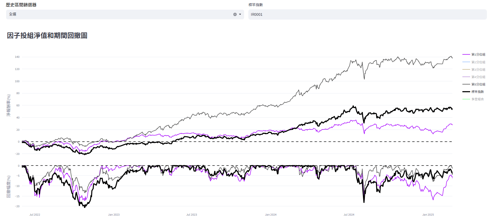
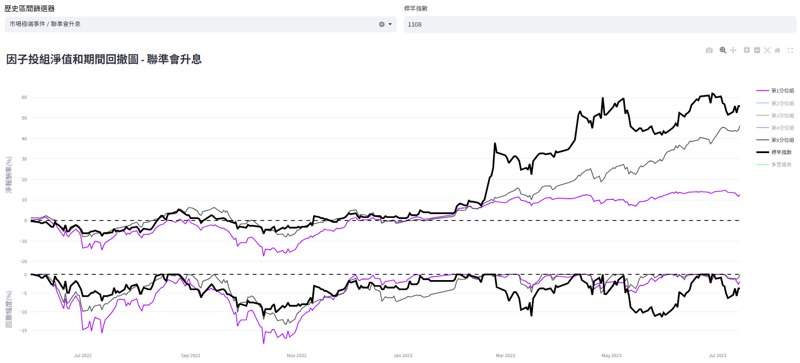
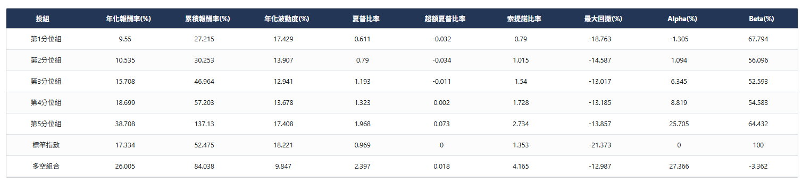
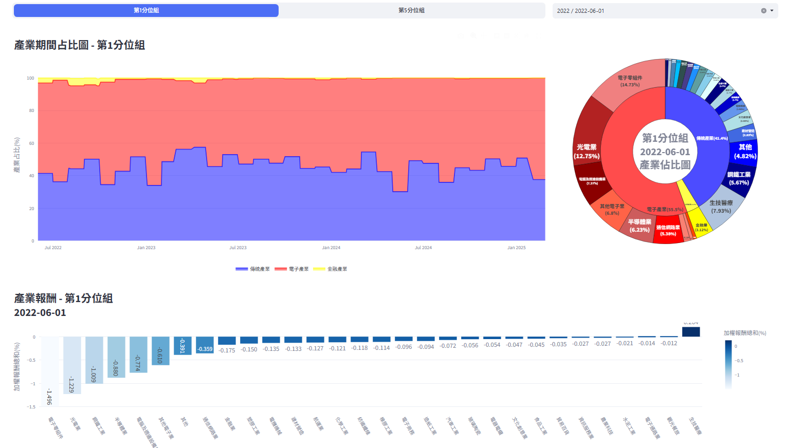

# 投組分析
分析實際使用因子所選之股票組成投資組合，觀察其在回測歷史期間的淨值走勢以及績效指標，以便了解使用該因子組成投組之風險報酬屬性。

<!-- :::{contents}
:local:
:depth: 2
::: -->

## 期間走勢

依據各因子投組於再平衡日組成之成分股與分配之權重，計算回測期間的投組報酬，用以分析因子實際用於選股投資的歷史表現，公式如下：

$$
\text{Portfolio}_{g,t} = \sum_{i=1}^{k} w_{i,g,t} \cdot \text{return}_{i,t^*}
$$

其中
$\text{Portfolio}_{g,t}$為第g因子投組於t日的加權報酬總和；
$w_{i,g,t}$為個股i於第g因子投組中在t日的權重；
$\text{return}_{i,t^*}$為個股i於t日之報酬率；
k為第g因子投組於t日之成分股數。
 

圖形上方為投組淨報酬率使用各因子投組之每日報酬複利連乘而來，下方為期間的回徹幅度。除此之外，最上方亦提供歷史區間篩選器以及標竿指數輸入處，提供使用者想查看特定年份或重大事件，以及想將投組與特定個股比對之功能。

如下圖為歷史區間篩選器選擇聯準會升息(2022/06/01 ~ 2023/07/14)期間，並且選擇幸福水泥(1108)作為同期間標竿指數(黑線)的結果。

除了投組淨報酬率圖以外，下方亦提供各因子投組與標竿指數的績效指標，方便使用者更好量化因子投組的表現。

績效指標說明如下：

- 年化報酬率：

    $$
    \text{Annual Return}_g = \left( \prod_{t=1}^{N} (1 + \text{Portfolio}_{g,t}) \right)^{\frac{D}{N}} - 1
    $$

    其中
    $\text{Annual Return}_g$為第g因子投組的年化報酬率；
    $ \text{Portfolio}_{g,t}$為第g因子投組於t日的加權報酬總和；
    N為回測歷史總天數；D為一年天數，此處設為252日。

 

- 累積報酬率：

    $$
    \text{Cumulative Return}_g = \prod_{t=1}^{N} (1 + \text{Portfolio}_{g,t}) - 1
    $$

    其中
    $\text{Cumulative Return}_g$為第g因子投組的累積報酬率；
    $\text{Portfolio}_{g,t}$為第g因子投組於t日的加權報酬總和；
    N為回測歷史總天數。
 

- 年化波動度：

    $$
    \text{Annual Volatility}_g = \text{Std}(\text{Portfolio}_{g,t}) \cdot \sqrt{D}, \quad t \in [1, N]
    $$

    其中
    $\text{Annual Volatility}_g$為第g因子投組的年化波動度；
    $\text{Portfolio}_{g,t}$為第g因子投組於t日的加權報酬總和；
    D為一年天數，此處設為252日；N為回測歷史總天數。
 

- 夏普比率：

    $$
    \text{Sharpe Ratio}_g = \frac{\text{Mean}(\text{Portfolio}_{g,t}) - R_{\text{free}}}{\text{Std}(\text{Portfolio}_{g,t})} \cdot \sqrt{D}, \quad t \in [1, N]
    $$

    其中
    $\text{Sharpe Ratio}_g$為第g因子投組的夏普比率；
    $\text{Portfolio}_{g,t}$為第g因子投組於t日的加權報酬總和；
    D為一年天數，此處設為252日；N為回測歷史總天數；
    $R_{\text{free}}$為同期間的無風險利率，此處設為0；
    N為回測歷史總天數。

 

- 超額夏普比率：

    $$
    \text{Excess Sharpe Ratio}_g = \frac{\text{Mean}(\text{Portfolio}_{g,t} - \text{Benchmark}_t)}{\text{Std}(\text{Portfolio}_{g,t} - \text{Benchmark}_t)}, \quad t \in [1, N]
    $$

    其中
    $\text{Excess Sharpe Ratio}_g$為第g因子投組的超額夏普比率；
    $\text{Portfolio}_{g,t} $為第g因子投組於t日的加權報酬總和；
    $\text{Benchmark}_t$為標竿指數於t日的報酬率，此處預設為台股加權報酬指數（IR0001）；
    N為回測歷史總天數。

 

- 索提諾比率：

    $$
    \text{Sortino Ratio}_g = \frac{\text{Mean}(\text{Portfolio}_{g,t}) - R_{\text{required}}}{\text{Std}(\text{Portfolio}_{g,t,\text{negative}})}, \quad t \in [1, N]
    $$

    其中
    $\text{Sortino Ratio}_g$為第g因子投組的索提諾比率；
    $\text{Portfolio}_{g,t}$為第g因子投組於t日的加權報酬總和；
    $R_{\text{required}}$為最低要求報酬，此處預設為0；
    ${Portfolio}_{g,t,\text{negative}}$為第g因子投組於回測歷史的負向報酬；
    N為回測歷史總天數。

 

- 最大回撤：

    $$
    \text{Max Drawdown}_g = \max_t \left(1 - \frac{\text{Cumulative Return}_{g,t}}{\max_{s \leq t} \text{Cumulative Return}_{g,s}} \right), \quad t \in [1, N]
    $$

    其中
    $\text{Max Drawdown}_g$為第g因子投組的期間最大回撤值；
    $\text{Cumulative Return}_{g,t}$為第g因子投組於t日的累積報酬率；
    $\max_{s \leq t} \text{Cumulative Return}_{g,s}$為第g因子投組於t日（含）的累積報酬率最大值；
    N為回測歷史總天數。

 

- Alpha、Beta：

    $$
    \text{Alpha}_g = \left( 1 + \frac{1}{N} \sum_{t=1}^{N} (\text{Portfolio}_{g,t} - R_{\text{free}} - \beta_g \cdot \text{Benchmark}_{t,\text{free}}) \right)^D - 1, \quad t \in [1, N]
    $$

    $$
    \text{Beta}_g = \frac{\text{Cov}(\text{Portfolio}_{g,t}, \text{Benchmark}_{t,\text{free}})}{\text{Var}(\text{Benchmark}_{t,\text{free}})}
    $$

    其中
    $\text{Alpha}_g$為第g因子投組的Alpha值；
    $\text{Portfolio}_{g,t} - R_{\text{free}}$為第g因子投組於t日的報酬減去t日無風險利率，無風險利率此處預設為0；
    $\text{Benchmark}_{t,\text{free}}$為標竿指數於t日報酬減去t日無風險利率，標竿指數預設為台股加權報酬指數（IR0001）；
    D為一年天數，此處設為252日；N為回測歷史總天數。

 

## 產業分布

使用證券交易所與櫃買中心公告之產業分類，原訂共有47個產業類別，此處為求方便分析使用，將不同交易市場但產業類別相同之個股劃分為同一產業，最終共有35個子產業類別。又為求時序列上分析方便，將35個子產業類別進一步聚合成「電子、傳統、金融」等三大主產業，表格如下：

<!-- | 主產業 | 子產業 |
|--------|--------|
| 電子   | 電子零組件、半導體業、電腦及週邊設備業、光電電子業、通訊網路業、光電業、電子通路業、資訊服務業、電子商務、數位雲端 |
| 傳統   | 水泥工業、食品工業、觀光餐旅、塑膠工業、汽車工業、紡織纖維、橡膠、造紙業、電機機械、鋼鐵工業、生技醫療、營建資產、化學生技醫療、航運業、能源工業、傳產工業、百貨通路、橡膠機械、消費百貨、文化創意、農業科技、運動休閒、居家生活、綠能環保 |
| 金融   | 金融業 | -->

<table style="width:100%; table-layout:fixed; border-collapse:collapse; border: 2px solid black;">
  <thead>
    <tr style="background-color:#f0f0f0;">
      <th style="width:15%; border:1px solid black; padding:6px;">主產業</th>
      <th style="width:85%; border:1px solid black; padding:6px;">子產業</th>
    </tr>
  </thead>
  <tbody>
    <tr>
      <td style="border:1px solid black; padding:6px;">電子</td>
      <td style="border:1px solid black; padding:6px;">
        電子零組件、半導體業、電腦及週邊設備業、光電電子業、通訊網路業、光電業、電子通路業、資訊服務業、電子商務、數位雲端
      </td>
    </tr>
    <tr>
      <td style="border:1px solid black; padding:6px;">傳統</td>
      <td style="border:1px solid black; padding:6px;">
        水泥工業、食品工業、觀光餐旅、塑膠工業、汽車工業、紡織纖維、橡膠、造紙業、電機機械、鋼鐵工業、生技醫療、營建資產、化學生技醫療、航運業、能源工業、傳產工業、百貨通路、橡膠機械、消費百貨、文化創意、農業科技、運動休閒、居家生活、綠能環保
      </td>
    </tr>
    <tr>
      <td style="border:1px solid black; padding:6px;">金融</td>
      <td style="border:1px solid black; padding:6px;">金融業</td>
    </tr>
  </tbody>
</table>

 

- 產業期間占比圖：依據前項三大產業進行聚合之主產業時序列占比圖，將每天分別屬於各主產業下的子產業權重加總。

- 產業報酬：各子產業下加權報酬總和，公式如下：

    $$
    \text{Sub Industry Return}_{g,j,t} = \sum_{j=1}^{k} w_{j,g,t} \cdot \text{Holding Return}_{j,g,t}, \quad t \in [1, \text{Period}]
    $$

    其中
    $\text{Sub Industry Return}_{g,j,t}$為第g因子投組下j產業於t日的加權後持有期間報酬總和；
    $w_{j,g,t}$為個股i於第g因子投組下在t日時的投組權重；
    $\text{Holding Return}_{j,g,t}$為個股i在第g因子投組於t日的持有期間報酬，例如個股從月初持有到下一月初時的期間報酬；
    Period為回測期間的再平衡週期數。

 

## 交易紀錄

交易紀錄提供使用者查看各因子投組於回測期間之成分股、買賣時間與價格與含息報酬等資訊。點擊每列最右側的「打開報表」按鍵會載入該股票位於指定因子投組期間的所有進出場與報酬率，協助使用者更好觀看投組的報酬來源。

