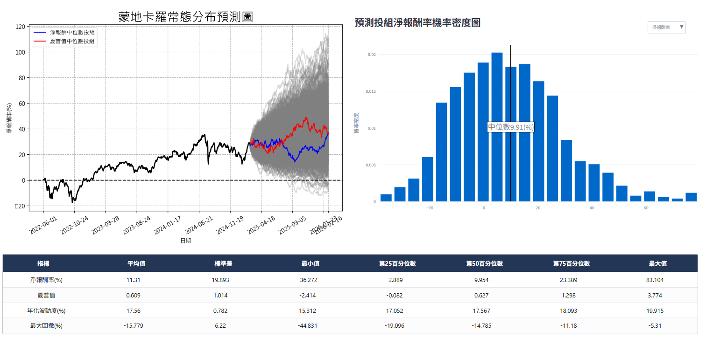

# 風險分析
基於蒙地卡羅的抽樣模擬概念，藉由因子投組歷史的日報酬模擬未來可能的風險。

<!-- :::{contents}
:local:
:depth: 2
::: -->

## 蒙地卡羅預測

使用者可選擇自投組回測完的最後一天起預測未來N天的投組報酬，此處提供常態分布、對數常態分布、重複抽樣與偏態分布等四種分布模型，另外搭配一調整係數，主要用於調整常態分布、對數常態分布模型之標準差倍數，以及偏態分布之偏態係數倍數，供使用者模擬更加波動的未來報酬。

- 常態分布模型：使用因子投組回測歷史之日報酬平均值與標準差擬合常態分布進行抽樣模擬，機率密度函式如下：

    $$
    p(x) = \frac{1}{\sqrt{2\pi\sigma_g^2}} \exp\left( -\frac{(x_g - \mu_g)^2}{2\sigma_g^2} \right)
    $$

    其中
    $x_g$為第g因子投組回測歷史之日報酬；
    $μ_g$為第g因子投組回測歷史之日報酬平均值；
    $σ_g$為第g因子投組回測歷史之日報酬標準差。

 

- 對數常態分布模型：使用因子投組回測歷史之日報酬平均值與標準差擬合對數常態分布進行抽樣模擬，機率密度函式如下：

    $$
    p(x) = \frac{1}{x_g\sigma_g\sqrt{2\pi}} \exp\left( -\frac{(\ln(x_g) - \mu_g)^2}{2\sigma_g^2} \right)
    $$

    其中
    $x_g$為第g因子投組回測歷史之日報酬；
    $μ_g$為第g因子投組回測歷史之日報酬平均值；
    $σ_g$為第g因子投組回測歷史之日報酬標準差。
 

- 重複抽樣：採抽後放回方式進行抽樣模擬。

 

- 偏態分布模型：使用因子投組回測歷史之日報酬平均值、標準差與偏態係數擬合偏態分布模型進行抽樣模擬，機率密度函式如下：

    $$
    f(x_g; \mu_g, \sigma_g, \xi_g) = \frac{2}{\sigma_g} \phi\left( \frac{x_g - \mu_g}{\sigma_g} \right) \Phi\left( \xi_g \cdot \frac{x_g - \mu_g}{\sigma_g} \right)
    $$

    其中
    $x_g$為第g因子投組回測歷史之日報酬；
    $\mu_g, \sigma_g, \xi_g$分別為第g因子投組日報酬之平均值、標準差和偏態係數；
    $ϕ(z)$為常態不分機率密度函數；
    $Φ(z)$為常態分布累積分布函數。