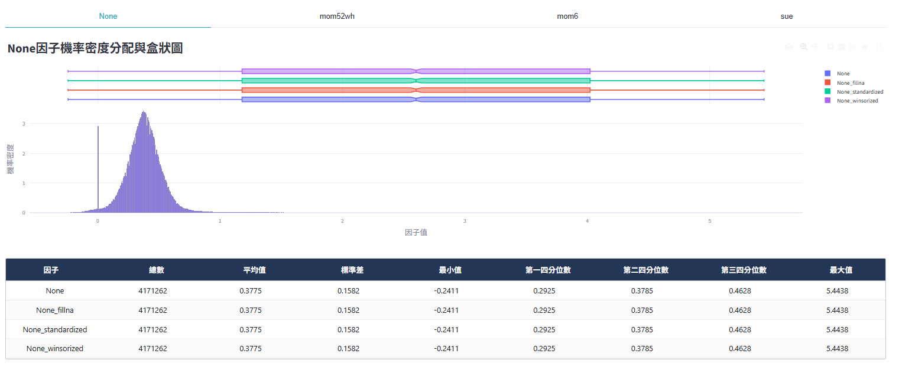
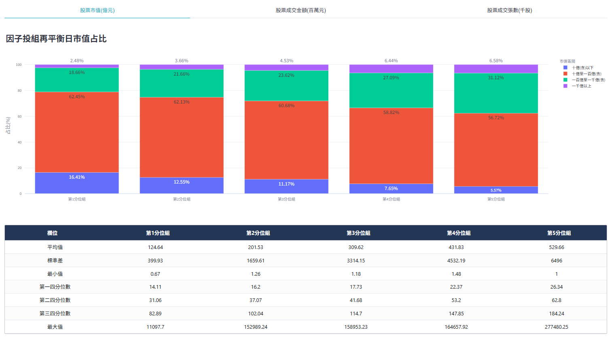

# 敘述統計
觀察因子投組於再平衡t日的因子值分布狀況與股票之市值、成交金額和成交張數等特徵值狀況。

<!-- :::{contents}
:local:
:depth: 2
::: -->

## 因子值分布

呈現單因子或複合因子經過前處理調整各階段後的機率密度分布圖、箱型圖，以及各階段的敘述統計數據，如下圖1為使用mom52wh（創一年新高動能因子）和mom6（六個月期動能因子）與sue（未預期盈餘）所等權重合成出的複合因子。

## 股票樣本

統計各個因子投組位於每個再平衡日的總市值、成交金額與成交張數的占比資訊，協助使用者分析投組樣本的股市特徵，按照下列區間進行計算：
+ 總市值（億元）：十億（含）以下、十億至一百億（含）、一百億至一千億（含）、一千億以上等四個區間。
+ 成交金額（百萬元）：一百萬（含）以下、一百萬至一千萬（含）、一千萬至一億（含）、一億至十億（含）、十億以上等五個區間。
+ 成交張數：一百張（含）以下、一百張至一千張（含）、一千張至一萬張（含）、一萬張至十萬張（含）、十萬張以上等五個區間。

上述計算完每個再平衡日各區間的占比後再取平均值。

