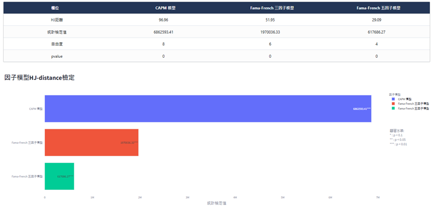

# 學術檢定
以更嚴謹的學術理論來解釋因子投組報酬，並且與常見的CAPM、FamaFrench-3因子與FamaFrench-5因子模型進行比較，看因子投組報酬在被這些模型解釋同時能否賺取超額報酬(alpha)。

<!-- :::{contents}
:local:
:depth: 2
::: -->

## Newey-West檢定

使用因子模型檢驗投資組合是否存在超額報酬（alpha）時，本文提供了兩種檢驗方法：General 與 Newey-Test。

- General 方法：透過傳統的 alpha估計方式，利用 CAPM、Fama-French 三因子或五因子模型對投組的超額報酬進行回歸，估計出alpha並以 t 檢定判斷是否具有顯著的超額報酬。

- Newey-Test 方法：由於傳統方法未調整異質性（Heteroskedasticity）及自我相關性（Autocorrelation），可能導致參數標準誤偏差，進而使 t 值失真。因此在 Newey-Test 中，我們在 OLS 回歸時設定共變異數矩陣為 HAC（Heteroskedasticity and Autocorrelation Consistent），並採用 Lag = 4 * (T / 100 ) ** ( 2 / 9 )的方式（其中 T 為樣本期數）來確定回歸殘差的自我相關調整範圍，藉此放大標準差、縮小 t 值，降低過度拒絕（Type I Error）的風險。若Newey-Test 方法檢定結果與經典的 t 檢定相反，則說明該因子的解釋能力可能是由異質性或自我相關性導致。

總結而言，General 方法可快速檢驗超額報酬是否顯著；而 Newey-Test 方法則在估計過程中進一步考量了異質性與自我相關性，使其檢定結果更為穩健。
 

## GRS檢定

- 假設有 1000 支股票，其中 900 支的 CAPM 模型 alpha 不顯著，僅有 100 支具有顯著的alpha。經典的 t 檢定會拒絕 CAPM 模型，在這種情況下，是否應該認為 CAPM 模型成立？還是需要進一步檢驗？
- Gibbons, Ross 和 Shanken（1989）提出的 GRS 檢定，旨在針對一組資產或股票的共同超額報酬（alpha）進行「聯合為零」的檢定。相較於僅針對單一股票進行 alpha 的 t 檢定，GRS 檢定可以一次檢驗所有候選股票的 alpha 是否同時為零。

- 若 GRS 檢定的統計量不顯著，代表在特定的假設條件下，模型可以有效解釋所有股票的報酬，並無任何顯著超額報酬；反之，***若檢定結果顯著，則意味著存在某些投組無法被模型解釋，顯示該模型的定價能力不足***，需要進一步探討或加入其他因子來修正模型。透過這樣的「整體檢定」，研究者可以避免僅憑局部（例如某些股票或投組）出現顯著 alpha 就完全否定模型的可能性，也能更全面地評估模型在解釋市場報酬上的完整度。
- 若GRS 檢定結果與經典的 t 檢定相反，則***說明該因子的解釋能力可能是由分組間相關性***導致。

 

## HJ-distance檢定

- Hansen-Jagannathan (HJ) 距離是由 Lars Peter Hansen 與 Ravi Jagannathan（1991）提出的一種檢驗資產定價模型有效性的統計方法。它的核心概念在於測量模型所造成的定價誤差（misspecification），若該誤差明顯存在，便代表現有模型無法充分解釋資產的報酬。
- 在一般檢驗因子定價時，若預設模型已「正確規範（correctly specified）」，傳統方法計算出的標準誤可能低估了模型的可能誤差，導致錯誤結論。相較之下，HJ 距離能在考量模型錯誤規範的情況下，檢驗資產定價是否存在顯著的「不可解釋部分」。

- 若 HJ 距離檢定的 p 值顯著，代表該模型存在無法解釋的定價誤差，需要將本次分析的「因子異象」納入模型才能更好地解釋報酬來源。

- 反之，若 p 值不顯著，則顯示現行模型已能良好解釋投資組合的報酬，不需要另外加入新因子。

