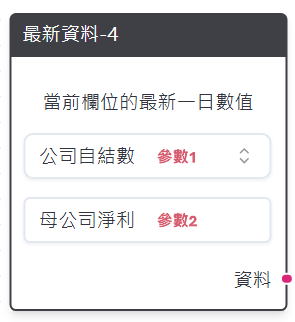
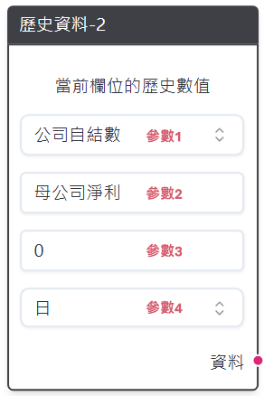
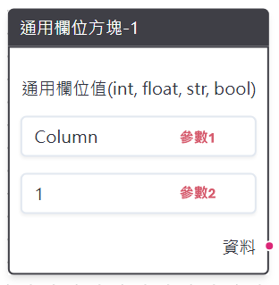
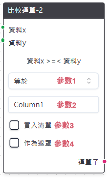
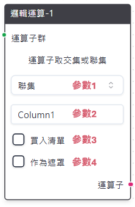
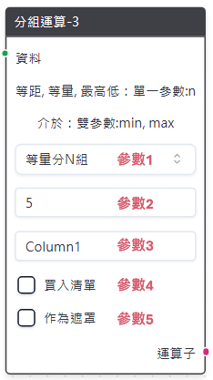
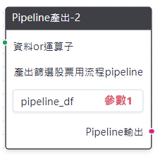
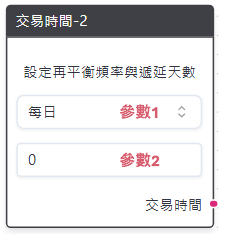
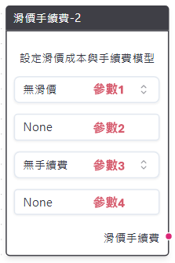
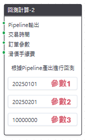

# 節點詳細說明
詳述各節點功能、可輸入之參數、可接入之節點與可輸出之節點與所有相關的注意事項。

## 資料載入

流程圖節點的基礎單位，分為最新資料、歷史資料與通用欄位方況等三種，每次回測或表格之產出均需要至少一個資料載入相關的節點在流程圖其中。目前提供之資料表有股價資料、籌碼資料、公司自結數、會計師簽證財務資料與月營收（版本別）

- 最新資料

    :::{toggle} 圖片
     
    :::

    - 功能：產出指定股票池中所有公司最新一日資料欄位，若該欄位有版本別註記，則產出則會調整為當下時間點所能看到之最新版本資料。
    - 參數1：公司自結數、會計師簽證財務資料、股價資料、月營收（版本別）、籌碼資料（日）。
    - 參數2：參數1中所對應的資料欄位名稱，可參考策略Studio右上角之「資料欄位查詢」。
    - 上游可連線節點：無。
    - 下游可連線節點：比較運算、分組運算與Pipeline產出。

 

- 歷史資料

    :::{toggle} 圖片
    
    :::

    - 	功能：產出指定股票池中所有公司歷史時間點的資料欄位，若該欄位有版本別註記，則產出則會調整為當下時間點所能看到之最新版本資料。
    - 	參數1：公司自結數、會計師簽證財務資料、股價資料、月營收（版本別）、籌碼資料（日）。
    - 	參數2：參數1中所對應的資料欄位名稱，可參考策略Studio右上角之「資料欄位查詢」。
    - 	參數3：常數值N，作為取過去N日、月或季的依據。
    - 	參數4：股價籌碼支援N日前；會計與自結數財報支援N日與N季前；月營收支援N日與N月前。
    - 	上游可連線節點：無。
    - 	下游可連線節點：比較運算、邏輯運算、分組運算與Pipeline產出。

 

- 通用欄位方塊

    :::{toggle} 圖片
    
    :::

    - 	功能：產出一指定的欄位名稱與欄位數值，主要用作比較運算中的判斷基準。
    - 	參數1：欄位輸出名稱。
    - 	參數2：欄位數值，可輸入常數、浮點數、文字與布林值。
    - 	上游可連線節點：無。
    - 	下游可連線節點：比較運算與Pipeline產出。

 

## 條件計算

- 比較運算

    :::{toggle} 圖片
    
    :::

    - 	功能：x欄位與y欄位之間的關係運算子，讓使用者可針對特定。
    - 	參數1：大於、大於等於、小於、小於等於、等於和不等於六種選項。
    - 	參數2：欄位輸出名稱。
    - 	參數3：買入清單，若打勾則該欄位將用做後續買入股票之依據。
    - 	參數4：作為遮罩，若打勾則該欄位將用做後續篩選股票的基礎。
    - 	上游可連線節點：最新資料、歷史資料與通用欄位方塊。
    - 	下游可連線節點：邏輯運算、分組運算（需作為遮罩）與Pipeline產出。

 

- 邏輯運算：

    :::{toggle} 圖片
    
    :::

    - 	功能：將各個連線的運算子群取聯集（or）或交集（and）。
    - 	參數1：聯集（or）或交集（and）。
    - 	參數2：欄位輸出名稱。
    - 	參數3：買入清單，若打勾則該欄位將用做後續買入股票之依據。
    - 	參數4：作為遮罩，若打勾則該欄位將用做後續篩選股票的基礎。
    - 	上游可連線節點：邏輯運算、比較運算。
    - 	下游可連線節點：邏輯運算、分組運算（需作為遮罩）與Pipeline產出。

 

- 分組運算：

    :::{toggle} 圖片
    
    :::

    - 	功能：將指定資料切割成組別，或篩選出最高/低的N支股票。
    - 	參數1：等量分N組、等距分N組、最高N檔、最低N檔與介於min~max。

    <table style="border-collapse: collapse; width: 100%; font-size: 14px;">
        <thead style="background-color: #1f4e78; color: white;">
            <tr>
            <th style="border: 1px solid black; padding: 8px; color: white;">選項</th>
            <th style="border: 1px solid black; padding: 8px; color: white;">參數範例</th>
            <th style="border: 1px solid black; padding: 8px; color: white;">產出說明</th>
            </tr>
        </thead>
        <tbody>
            <tr style="background-color: #f9f9f9;">
            <td style="border: 1px solid black; padding: 8px;">等量分 N 組</td>
            <td style="border: 1px solid black; padding: 8px;">5</td>
            <td style="border: 1px solid black; padding: 8px;">將某欄位分為每組數量一致的 5 個組別，並標記為 1~5。</td>
            </tr>
            <tr style="background-color: #ffffff;">
            <td style="border: 1px solid black; padding: 8px;">等距分 N 組</td>
            <td style="border: 1px solid black; padding: 8px;">10</td>
            <td style="border: 1px solid black; padding: 8px;">將某欄位分為每組數值區間一致的 10 個組別，並標記為 1~10。</td>
            </tr>
            <tr style="background-color: #f9f9f9;">
            <td style="border: 1px solid black; padding: 8px;">最高 N 檔</td>
            <td style="border: 1px solid black; padding: 8px;">200</td>
            <td style="border: 1px solid black; padding: 8px;">若欄位值最高的 200 支股票並標記為 True。</td>
            </tr>
            <tr style="background-color: #ffffff;">
            <td style="border: 1px solid black; padding: 8px;">最低 N 檔</td>
            <td style="border: 1px solid black; padding: 8px;">500</td>
            <td style="border: 1px solid black; padding: 8px;">若欄位值最低的 500 支股票並標記為 True。</td>
            </tr>
            <tr style="background-color: #f9f9f9;">
            <td style="border: 1px solid black; padding: 8px;">介於 min~max</td>
            <td style="border: 1px solid black; padding: 8px;">20, 80</td>
            <td style="border: 1px solid black; padding: 8px;">若欄位值介於 20%~80% 之間的股票並標記為 True。</td>
            </tr>
        </tbody>
    </table>

    - 	參數2：參數1分組之依據，僅可輸入常數值。
    -   參數3：欄位輸出名稱。
    - 	參數4：買入清單，若打勾則該欄位將用做後續買入股票之依據。
    - 	參數5：作為遮罩，若打勾則該欄位將用做後續篩選股票的基礎。
    - 	上游可連線節點：最新資料、歷史資料、通用欄位方塊、邏輯運算（需作為遮罩）、比較運算（需作為遮罩）。
    - 	下游可連線節點：邏輯運算（需選擇最高/低Ｎ組與介於min~max等選項）、分組運算（需作為遮罩）與Pipeline產出。

 

## 回測產出

- Pipeline產出：

    :::{toggle} 圖片
    
    :::

    - 	功能：將連結的資料載入與條件計算區塊使用表格呈現，方便使用者查看篩選出的股票。產出之表格會出現在策略Studio下方的Pipeline表格，從中可進行表格切換、查詢日期與關鍵字搜尋。
    - 	參數1：表格名稱，方便產出多個表格時進行切換。
    - 	上游可連線節點：最新資料、歷史資料、通用欄位方塊、邏輯運算、比較運算與分組運算。
    - 	下游可連線節點：回測計算。

 

- 交易時間：

    :::{toggle} 圖片
    
    :::

    - 	功能：提供給回測計算區塊，設定投組再平衡頻率與遞延天數。
    - 	參數1：再平衡時間點，有每日、每週初/末和每月初/末等五種選項。
    - 	參數2：遞延時間天數，當前項設定每週初再平衡，而遞延天數設定3則代表每週初的第三個交易日進行再平衡；反之，若選擇每週末並設定天數為2，代表在每週最後一個交易日前兩天進行再平衡。僅可輸入常數項，
    - 	上游可連線節點：無。
    - 	下游可連線節點：回測計算。

 

- 滑價手續費：

    :::{toggle} 圖片
    
    :::

    - 	功能：提供給回測計算區塊，設定投組交易時的滑價與手續費成本模型。
    - 	參數1：滑價模型，提供無滑價、固定基點滑價、交易量滑價、百分比滑價與台股滑價等五種選項。
    - 	參數2：滑價模型參數，如下表所示。
    <table style="border-collapse: collapse; width: 100%; font-size: 14px;">
        <thead style="background-color: #1f4e78; color: white;">
            <tr>
            <th style="width:15%; border: 1px solid black; padding: 8px; color: white;">選項</th>
            <th style="width:15%; border: 1px solid black; padding: 8px; color: white;">參數範例</th>
            <th style="width:70%; border: 1px solid black; padding: 8px; color: white;">範例說明</th>
            </tr>
        </thead>
        <tbody>
            <tr style="background-color: #f9f9f9;">
            <tr style="background-color: #ffffff;">
            <td style="border: 1px solid black; padding: 8px;">固定基點滑價</td>
            <td style="border: 1px solid black; padding: 8px;">10</td>
            <td style="border: 1px solid black; padding: 8px;">成交價格為price ± 10/2。</td>
            </tr>
            <tr style="background-color: #f9f9f9;">
            <td style="border: 1px solid black; padding: 8px;">交易量滑價</td>
            <td style="border: 1px solid black; padding: 8px;">0.5, 0.1</td>
            <td style="border: 1px solid black; padding: 8px;">成交價格為price × [1 ± (0.01 ×min(trading_share, 0.5) ^ 2)]，其中trading_share為該次交易下單股數佔該日成交量之比例，前面參數0.5也代表每筆能成交的最大比例為50%。</td>
            </tr>
            <tr style="background-color: #ffffff;">
            <td style="border: 1px solid black; padding: 8px;">百分比滑價</td>
            <td style="border: 1px solid black; padding: 8px;">0.01</td>
            <td style="border: 1px solid black; padding: 8px;">成交價格為 price × (1 ± 0.01)。</td>
            </tr>
            <tr style="background-color: #f9f9f9;">
            <td rowspan="2" style="border: 1px solid black; padding: 8px; vertical-align: top;">台股滑價</td>
            <td style="border: 1px solid black; padding: 8px;">0.2</td>
            <td style="border: 1px solid black; padding: 8px;">
                成交價格為 price ± (2 × tick_diff)，0.1 代表參數是股價的最大比例約為 10%。 
                其中 tick_diff 為證交所股票價格的單位跳動。
            </td>
            </tr>
        </tbody>
    </table>

    - 	參數3：手續費模型，如下表所示。

    <table style="border-collapse: collapse; width: 100%; font-size: 14px;">
        <thead style="background-color: #1f4e78; color: white;">
            <tr>
            <th style="width:15%; border: 1px solid black; padding: 8px; color: white;">選項</th>
            <th style="width:15%; border: 1px solid black; padding: 8px; color: white;">參數範例</th>
            <th style="width:70%; border: 1px solid black; padding: 8px; color: white;">範例說明</th>
            </tr>
        </thead>
        <tbody>
            <tr style="background-color: #f9f9f9;">
            <td style="border: 1px solid black; padding: 8px;">每交易股數</td>
            <td style="border: 1px solid black; padding: 8px;">0.001, 1</td>
            <td style="border: 1px solid black; padding: 8px;">每交易 1 股需支付 0.001 元，每筆交易至少 1 元。</td>
            </tr>
            <tr style="background-color: #ffffff;">
            <td style="border: 1px solid black; padding: 8px;">每交易筆數</td>
            <td style="border: 1px solid black; padding: 8px;">5</td>
            <td style="border: 1px solid black; padding: 8px;">每完成 1 筆交易即須支付 5 元。</td>
            </tr>
            <tr style="background-color: #f9f9f9;">
            <td style="border: 1px solid black; padding: 8px;">每交易金額</td>
            <td style="border: 1px solid black; padding: 8px;">0.0015</td>
            <td style="border: 1px solid black; padding: 8px;">每完成 1 元交易需支付 0.0015 元。</td>
            </tr>
            <tr style="background-color: #ffffff;">
            <td style="border: 1px solid black; padding: 8px;">台股手續費</td>
            <td style="border: 1px solid black; padding: 8px;">None</td>
            <td style="border: 1px solid black; padding: 8px;">
                成交金額乘上券商手續費 0.1425%（最低 20 元）與交易稅 0.3%。
            </td>
            </tr>
        </tbody>
    </table>

    - 	手續費模型支援無手續費、每交易股數、每交易筆數、每交易金額與台股手續費等五種選項
    - 	上游可連線節點：無。
    - 	下游可連線節點：回測計算。

 

- 訂單參數：

    :::{toggle} 圖片
    
    :::

    - 	功能：提供給回測計算節點，設定更多關於投組內股票的交易邏輯。
    - 	參數1：成交時點，分為當日收盤成交與隔日收盤成交兩種。
    - 	參數2：每檔股票最大槓桿，設定0.8即代表若選出20支股票要交易，則每支股票最多買入總資金的100%/20*0.8即4%。
    - 	參數3：訂單存活日，僅可輸入常數，設定為0即代表當天下單後，無論訂單是否全部成交均會取消。
    - 	參數4：下單股數加權模型，提供等權重、市值加權與成交量加權等三種模型，市值加權與成交量加權公式如下：

        $$
        w_{i,t} = \frac{\text{Market Value}_{i,t}}{\sum_{i=1}^{N} \text{Market Value}_{i,t}}
        $$

        $$
        w_{i,t} = \frac{\text{Trading Amount}_{i,t}}{\sum_{i=1}^{N} \text{Trading Amount}_{i,t}}
        $$
        
        其中N為買入清單於t日篩選出的股票。

 

- 回測計算：

    :::{toggle} 圖片
    
    :::

    - 	功能：接收前述Pipeline產出、交易時間、滑價手續費與訂單參數等節點參數，產出準備回測之檔案供使用者選擇。
    - 	參數1：回測開始之日，可輸入20250501、2025-05-01、2025/05/01等三種格式。
    - 	參數2：回測結束之日，可輸入20250501、2025-05-01、2025/05/01等三種格式。
    - 	參數3：本金，僅可輸入常數。

