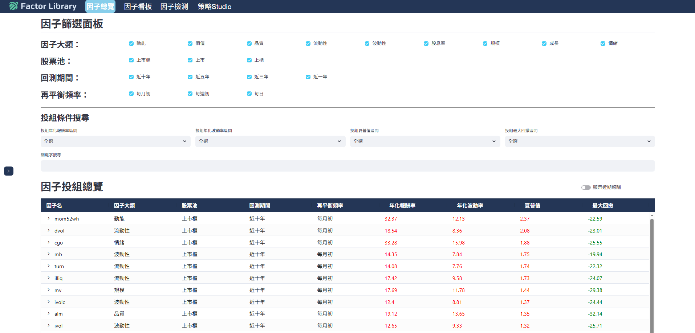
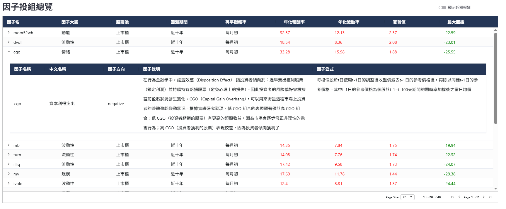
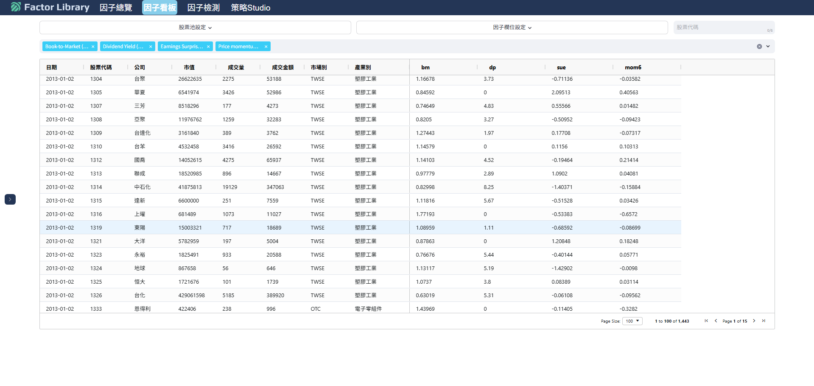
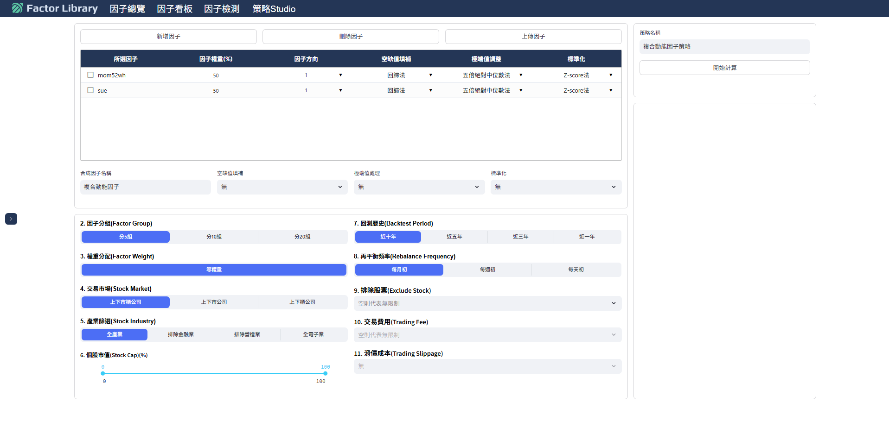
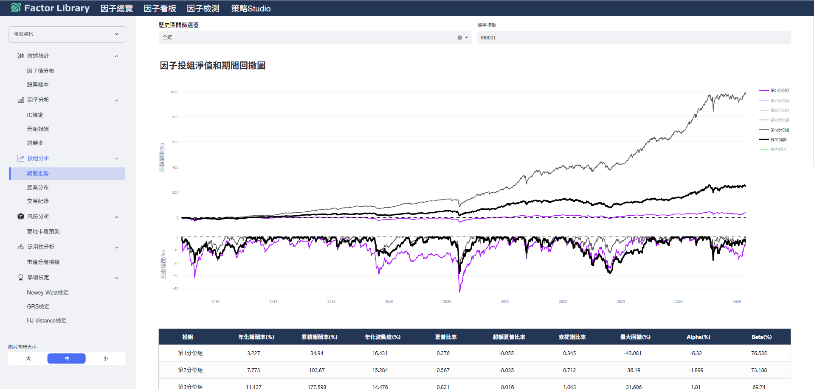
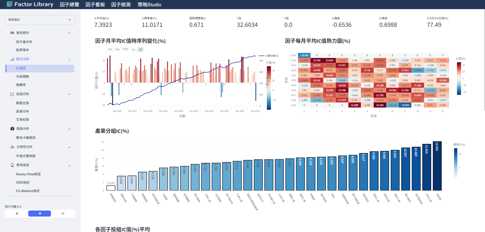
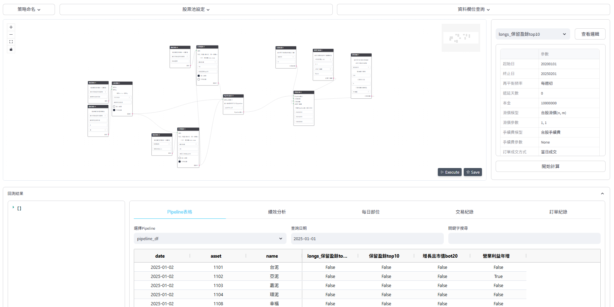
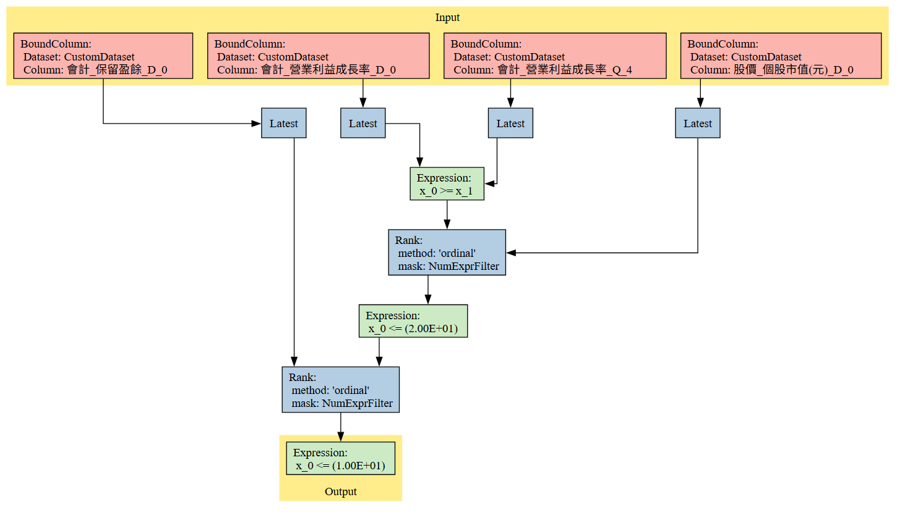
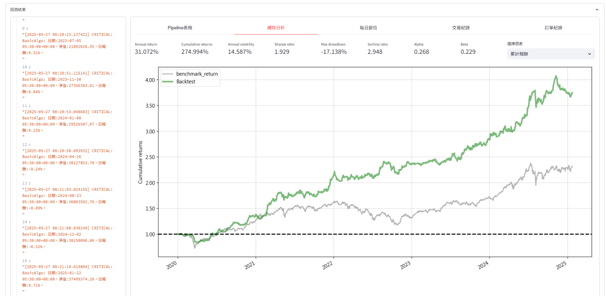
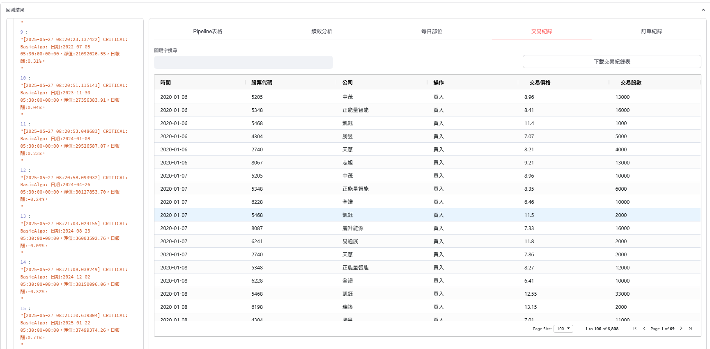

# 首頁

***多達九種的學術因子，完整的因子說明與公式***

  

  

 

***快速查找個股的因子值，強大的多因子檢測器***

  

  

 

***多樣化因子分析圖表，從IC、投組到學術檢驗應有盡有***

  

  

 

***無須撰寫程式碼，即可快速驗證策略想法***

  

  

 

***提供多樣分析圖表，以及完整的交易紀錄報表供檢驗***

  

  

 
